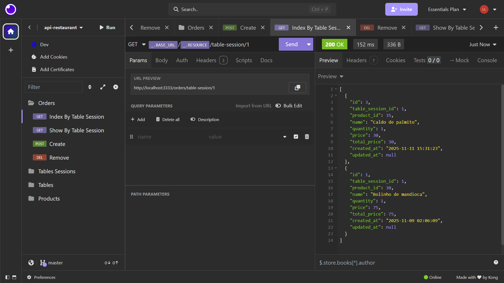

# API para gerenciar pedidos das mesas de um restaurante

## :hammer_and_wrench: Dependências


## :hammer_and_wrench: Ferramentas de Desenvolvimento


API de gerenciamento de pedidos das mesas de um restaurante. É possível usar a API para:</br>

1. Criar os itens (produtos) do cardápio;</br>
2. Criar as mesas do restaurante;</br>
3. Sinalizar que uma mesa está aberta ou fechada para pedidos (com ou sem clientes);</br>
4. Vincular itens pedidos para cada mesa e fazer o cálculo para fechamento das contas.



## :bulb: Como testar o projeto

**1. Ter o Git instalado em sua máquina;**</br>
**2. Clonar o repositório usando um terminal:**

```bash
git clone https://github.com/llucasgs/api-restaurant.git
```

Isso vai criar uma pasta com o nome do repositório. Então, abra a pasta dentro do editor de código **VS Code.**

**3. Execute no terminal:**

```bash
npm install
```

Isso vai instalar as dependências e recursos para rodar o projeto.

**4. Execute no terminal o script encontrado dentro do arquivo package.json:**

```bash
npm run dev
```

Isso vai rodar o servidor para ser possível fazer requisições e receber respostas.

**5. Use o Insomnia para fazer a comunicação com a API.**
